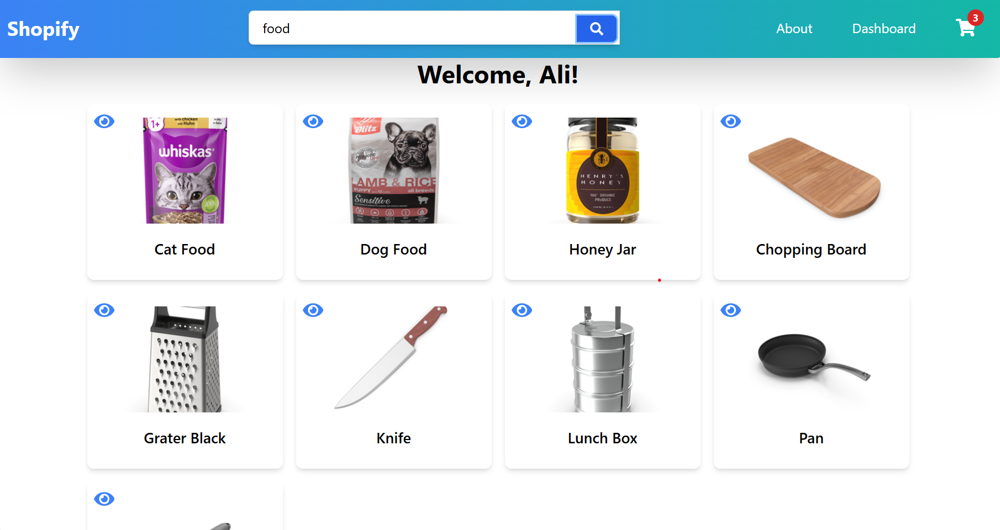
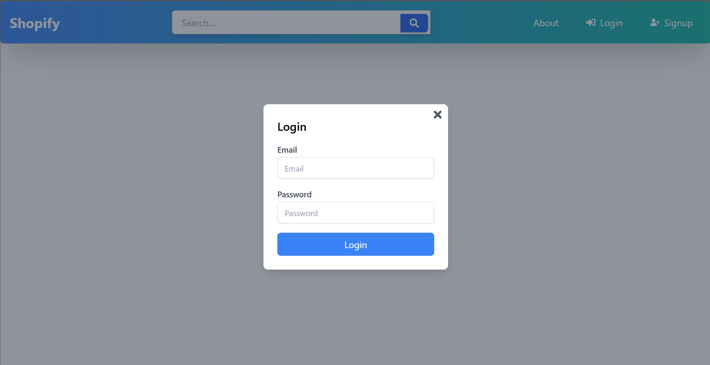
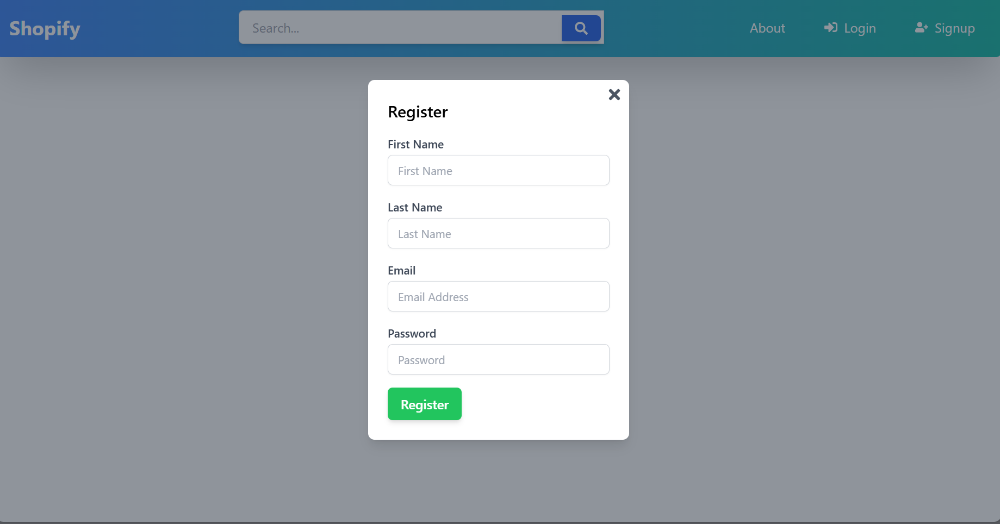
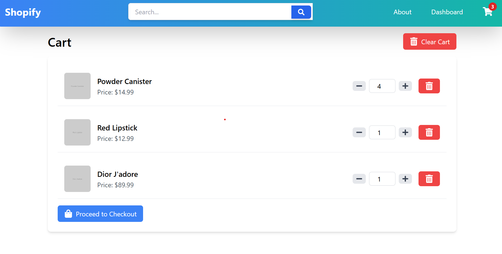
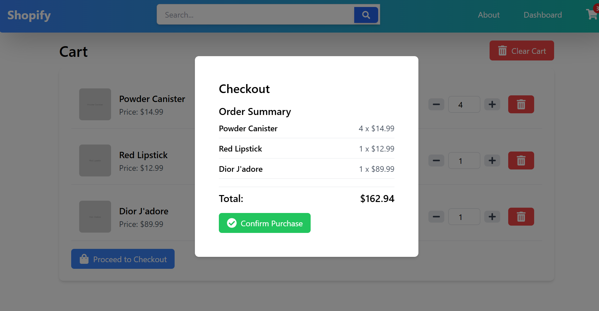

## Project Report: Shopify 

### Overview

In this project, I implemented a clone of the popular Shopify platform, named "Shopify" using modern web technologies and best practices. The project utilizes a fake API for product data, which can be accessed at [https://dummyjson.com/](https://dummyjson.com/).

### Technologies Used

- **React**: Employed with the Vite plugin for fast development and build processes.
- **React Router DOM**: Implemented for routing strategy to manage navigation between different views.
- **React Icons**: Utilized for professional and intuitive icon-based navigation.
- **Redux Toolkit**: Applied for efficient state management across the application.
- **Local Storage**: Used to store user data and other relevant information, accessible via the browser’s developer tools.

### Implementation Details

#### Home Page
The home page showcases the main interface of the Shopify Clone:

#### Search Functionality
A comprehensive search strategy is integrated to help users find products quickly:

#### Authentication
- **Login**: Users can access the application by logging in through a popup form:
  
- **Register**: New users can register via a popup form:
  

#### Product Details Page
A dedicated page for viewing detailed information about each product:

#### Cart Page
The cart page displays the items selected by the user for purchase:

#### Checkout Process
The checkout process is handled through a popup form for a streamlined user experience:

This implementation provides a comprehensive e-commerce experience, closely mimicking the Shopify platform’s functionality while utilizing modern tools and techniques for efficient development and user interaction.